# Gameplay NLW06 - React Native (Typescript)
 
 

## 📸 Preview

  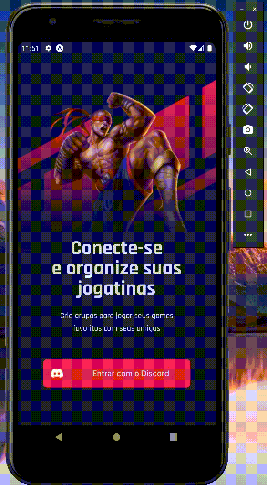

## 📝 Descrição

Aplicativo desenvolvido em React Native para agendamento de partidas online com amigos usando servidores do Discord como ponto de encontro. É possível agendar partidas, categorizar e escolher o servidor de encontro usando sua conta autenticada com a API do Discord.

## 🚀 Objetivo

Esse projeto foi criado com o objetivo de aplicar conhecimentos de React Native em uma aplicação mais robusta utilizando Typescript e se conectando a uma API externa. Além disso, foi possível explorar diversas bibliotecas para diferentes funcionalidades.

## 📌 Nota importante!
Esse projeto foi desenvolvido na Bootcamp da Rocketseat NLW Together. A ideia inicial do projeto e os assets utilizados foram disponibilizados pela equipe durante o evento. Você pode conferir mais detalhes no [projeto Figma](https://www.figma.com/community/file/991338130828322960/GamePlay) utilizado como base. Apesar de ser um projeto de bootcamp ele foi aprimorado com novas features e atualizado para as versões mais atuais das libs usadas.

## ✅ Features Funcionais
- Autenticação e captura de dados com a Discord API
- Persistência de usuário autenticado
- Criação de Appointments para encontros nos servidores do Discord
- Listagem dos servidores em que sua conta faz parte
- Filtragem de compromissos criados por categoria
- Detalhamento dos compromissos criados
- Compartilhamento de compromissos (Quando permitido)
- Redirecionamento ao servidor do compromisso (Quando permitido)
- Listagem de membros online no servidor do compromisso (Quando permitido)
- Tratamento de erros de formulário e de API
- Logout
- Exibição de frases de efeito aleatórias na tela de Home

## 📚 Lib's e suas aplicações 
* `expo-app-loading` - Componente de Loading
* `expo-vector-icons` - Pacote de icones
* `expo-font` e `expo-google-fonts` - Lib's para importação e carregamento de fonts
* `expo-status-bar` - Componente de manipulação da status bar
* `expo-linear-gradient` - Componente para criação de linear gradient's
* `expo-auth-session` - Lib para autentição OAuth2
* `react-native-svg-transformer` - Lib's para utilização de SVG's como componentes
* `react-native-iphone-x-helper` - Lib para capturar medidas do smartphone
* `react-nativation (v6)` - Lib para navegação do app
* `react-native-gesture-handler` - Pacote de componentes úteis
* `react-native-async-storage` - Lib para armazenamento de dados locais
* `react-native-uuid` - Lib para geração de ID's
* `axios` - Lib para realizar requisições web
* `dotenv` e `babel-plugin-inline-dotenv` - Lib para utilização de arquivos .env

## 🔎 Teste Você Mesmo

📌 **Pré requisitos:**

1. Tenha o repositório baixado em sua máquina.
2. Tenha o [NodeJS](https://nodejs.org/) instalado em sua máquina.
3. Tenha um virtual device Android ou iOS instalado em sua máquina.
4. Tenha o [Expo](https://docs.expo.dev/) instalado em sua máquina.

🚩 **Como Executar m um Vitual Device:**

1. Execute o seu virtual device.
2. Abra um terminal no diretório do projeto e execute o comando `npm install` para instalar as dependências.
3. Execute o comando `expo start` para iniciar o Expo. Por padrão irá abrir uma nova aba no seu navegador com a central de controle do expo.
4. Em Connection, seleciona a opção "Tunnel".
5. Para rodar o aplicativo em seu Virtual Device, clique em "Run on Android device/emulator" ou em "Run on iOS simulator".

Caso tenha alguma duvida sobre a execução do projeto usando Expo acesse a [documentação da inicialização de um projeto](https://docs.expo.dev/get-started/create-a-new-app/#starting-the-development-server).

## 📸 Preview das Telas

  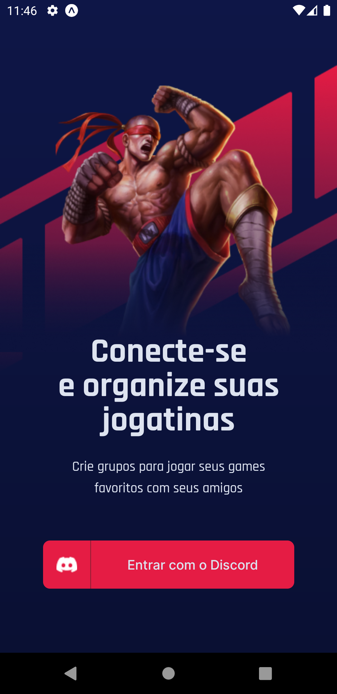
  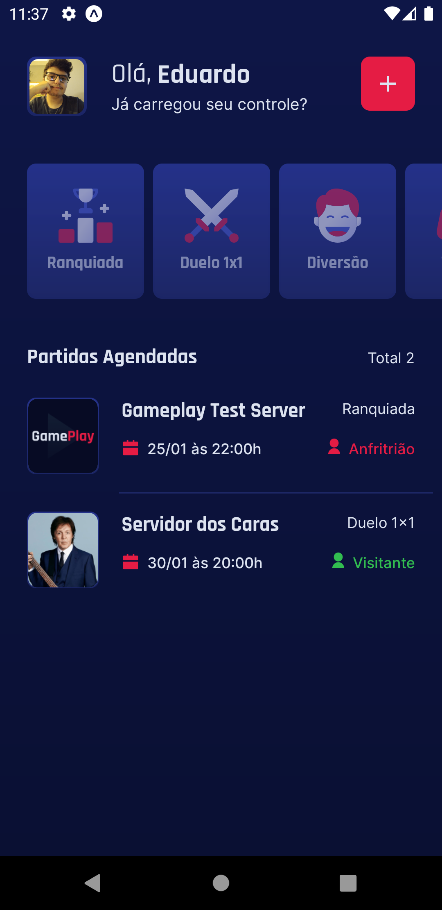
  
   
  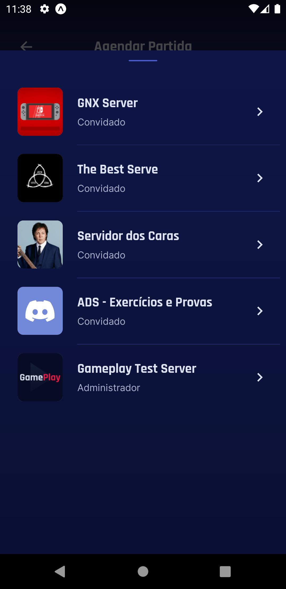
  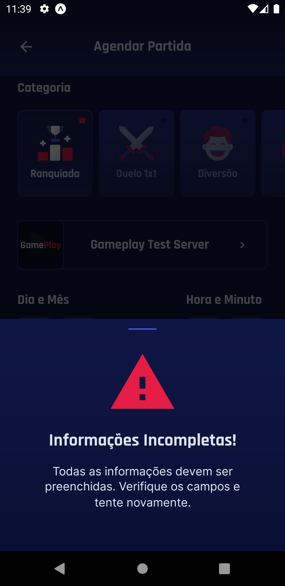
  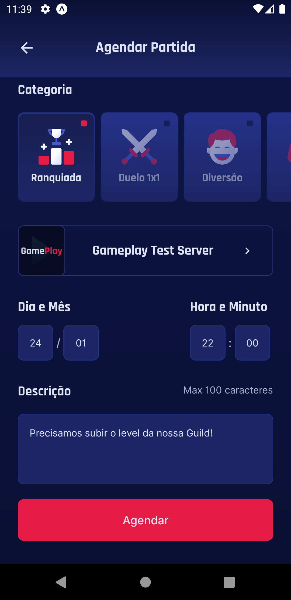
   
  
  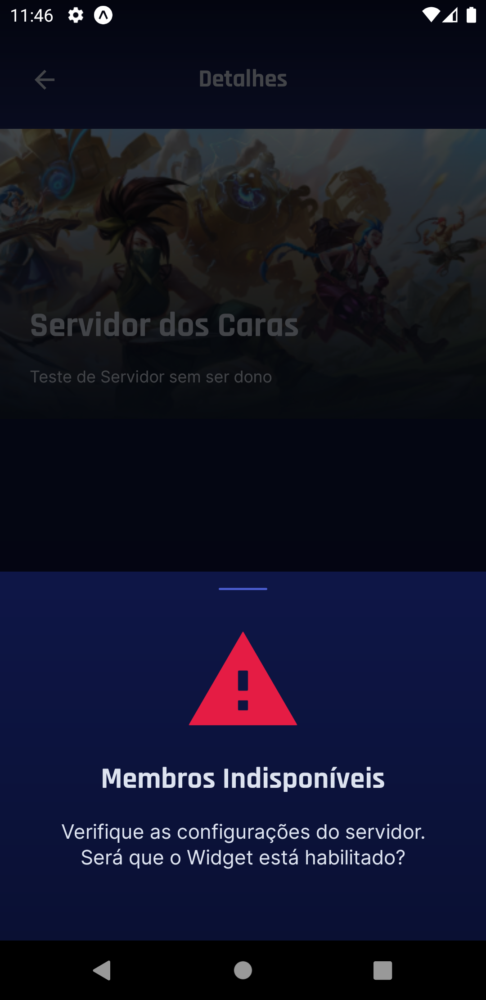
  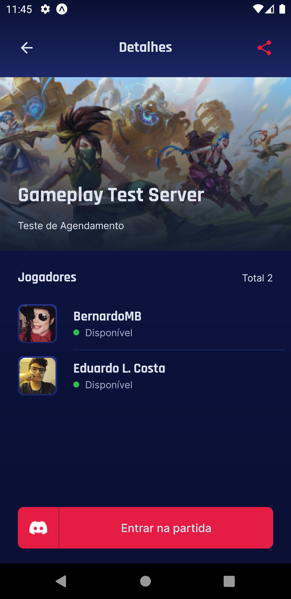
   
  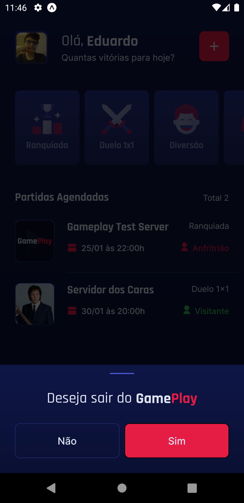

## 📸 Autenticação

  

## 📸 Criação de Appointment e Filtragem

  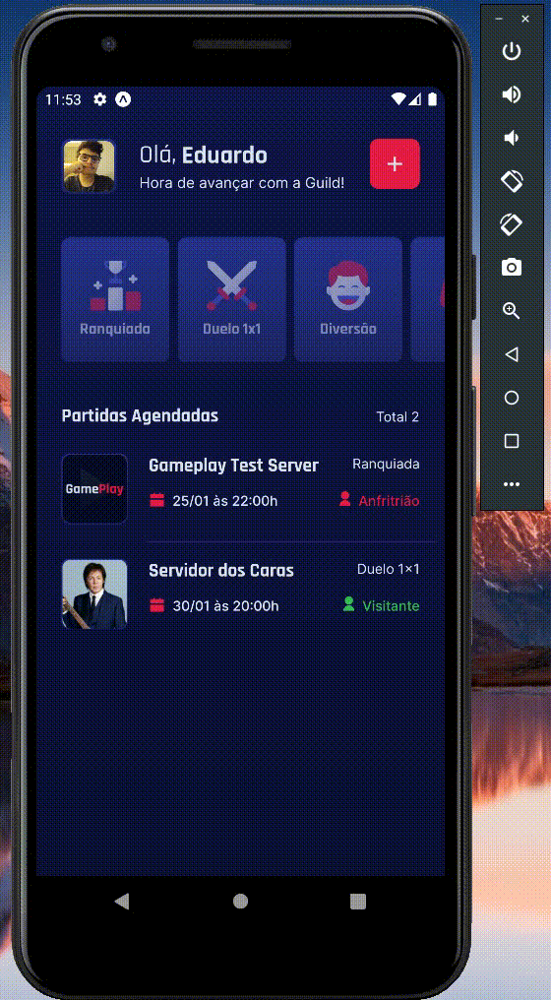

## 📸 Detalhes do Appointment

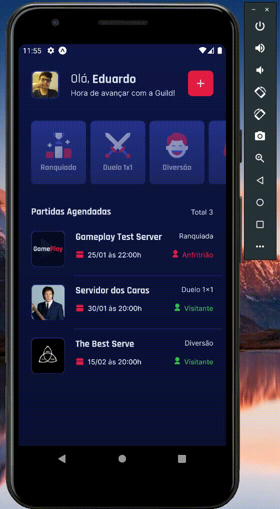

